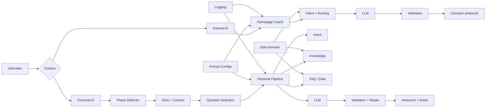
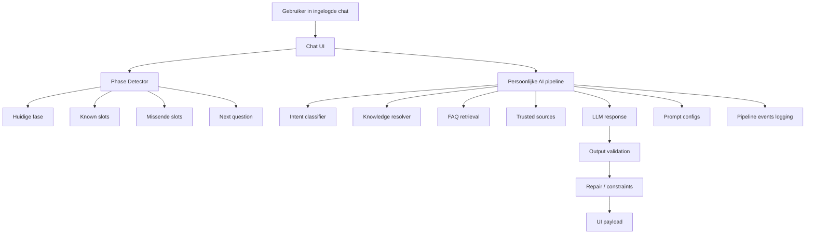
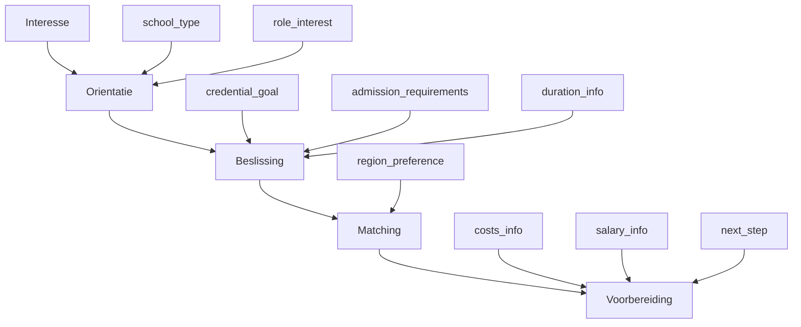
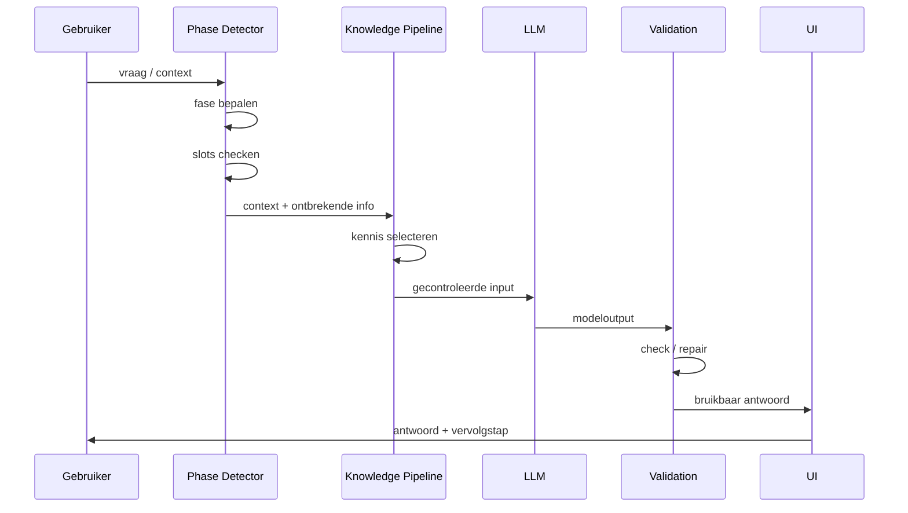
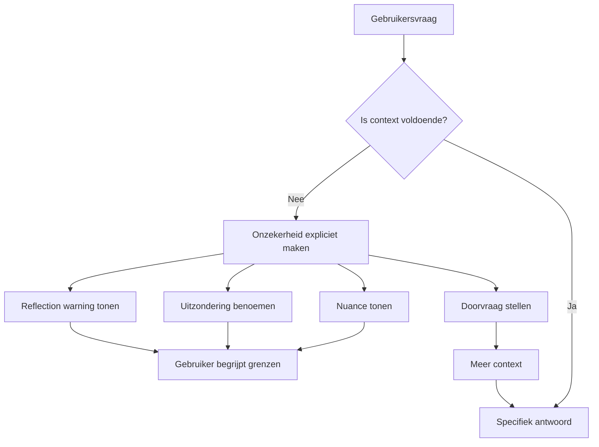
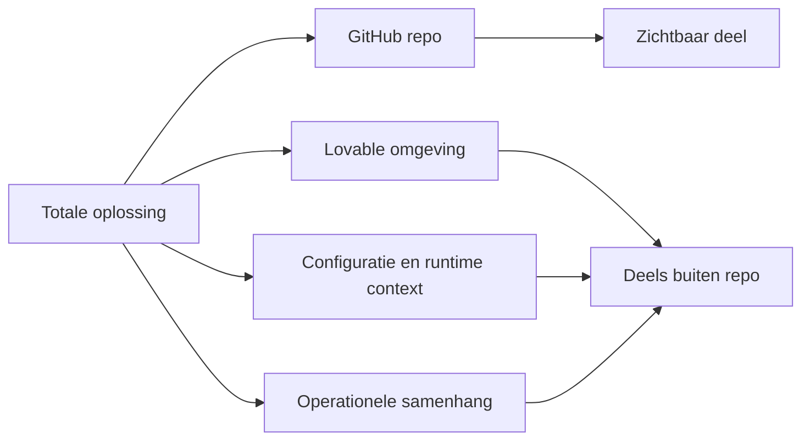
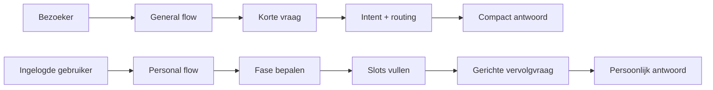
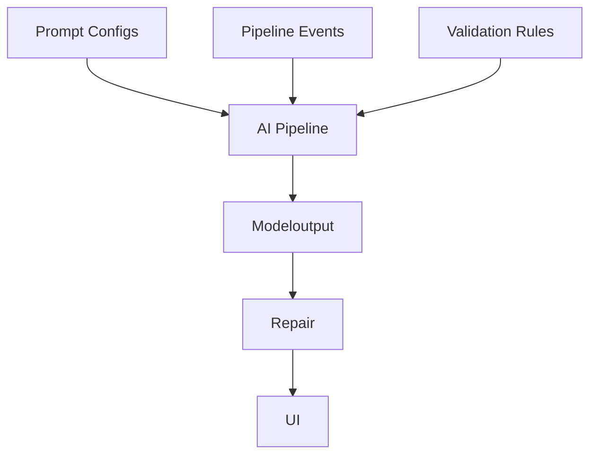

# Data Talents AI — toelichting op de huidige DOORAI Lovable-omgeving

Deze pagina beschrijft de huidige DOORAI Lovable-omgeving zoals die nu zichtbaar en uitlegbaar is op basis van de repository, de configuratiebestanden en de aangeleverde projectdocumenten.

Het doel van deze toelichting is om helder te maken:
- wat deze omgeving is
- waarom zij zo is ingericht
- hoe data, AI-logica en sturing in elkaar grijpen
- wat wel en niet direct zichtbaar is in GitHub
- waarom deze opzet relevant is voor partijen die kijken naar data, AI-architectuur, governance en uitlegbaarheid

---

## Inhoud

- [1. In het kort](#1-in-het-kort)
- [2. Context en doel](#2-context-en-doel)
- [3. Wat deze omgeving wel en niet is](#3-wat-deze-omgeving-wel-en-niet-is)
- [4. Waarom deze omgeving geschikt is voor eerlijke vergelijking](#4-waarom-deze-omgeving-geschikt-is-voor-eerlijke-vergelijking)
- [5. Data-opzet van de huidige omgeving](#5-data-opzet-van-de-huidige-omgeving)
- [6. Onderliggende ontwerpfilosofie: EAI](#6-onderliggende-ontwerpfilosofie-eai)
- [7. Twee AI-componenten in dezelfde omgeving](#7-twee-ai-componenten-in-dezelfde-omgeving)
- [8. Architectuur van de persoonlijke AI-component](#8-architectuur-van-de-persoonlijke-ai-component)
- [9. Phase detector en vragenset](#9-phase-detector-en-vragenset)
- [10. Guardrails, validatie en LLM-sturing](#10-guardrails-validatie-en-llm-sturing)
- [11. Hoe onzekerheid zichtbaar wordt in chat](#11-hoe-onzekerheid-zichtbaar-wordt-in-chat)
- [12. Actieve doorontwikkeling op basis van feedback](#12-actieve-doorontwikkeling-op-basis-van-feedback)
- [13. Belangrijke kanttekening over Lovable en GitHub](#13-belangrijke-kanttekening-over-lovable-en-github)
- [14. Visuele schema’s](#14-visuele-schemas)
- [15. Samenvatting](#15-samenvatting)
- [16. Technische onderbouwing](#16-technische-onderbouwing)

---

## 1. In het kort

De huidige DOORAI Lovable-omgeving is een **werkende testomgeving** waarin UX, data-opbouw en AI-ondersteuning samen worden beproefd.

De omgeving:
- werkt met een combinatie van vaste data, testdata en verrijkte inhoud
- bevat twee verschillende AI-componenten: een algemene en een persoonlijke
- gebruikt in de persoonlijke flow een deterministische phase detector
- werkt met een gestructureerde vraag- en slotlogica
- gebruikt validatie, repair, logging en promptbeheer
- laat in de UI ook expliciet zien wanneer antwoordkwaliteit of volledigheid aandacht vraagt

De omgeving moet daarom niet gelezen worden als een losse chatbot, maar als een **gecontroleerde AI-opzet**.

---

## 2. Context en doel

De huidige DOORAI Lovable-omgeving is geen vrijblijvende demo. Het is een werkende testomgeving waarin UX, data-opbouw en AI-ondersteuning samen worden beproefd. De opzet past bij de bredere DOOR-aanpak zoals die in de aangeleverde documenten is beschreven: een schaalbaar, neutraal en modulair digitaal loket dat bestaande databronnen benut en dat stap voor stap uitbreidbaar is naar andere regio’s en situaties.

De omgeving is dus opgezet om:
- een realistische gebruikerservaring te bieden
- AI-gedrag in een gecontroleerde setting te toetsen
- data, routes en advieslogica in samenhang te testen
- op basis van feedback iteratief te verbeteren

---

## 3. Wat deze omgeving wel en niet is

<strong>Wat deze omgeving wel is</strong>

Deze omgeving is:
- een serieuze werkende testomgeving
- een basis voor eerlijke vergelijking van UX- en AI-keuzes
- een modulaire AI-opzet met gescheiden rollen en pipelines
- een omgeving waarin inhoud, gebruikersinteractie en AI-gedrag samen worden gevalideerd
- een tussenstap richting een bredere, schaalbare DOOR-oplossing

<strong>Wat deze omgeving niet is</strong>

Deze omgeving is niet:
- de definitieve productieomgeving
- een volledig opgeschoonde eindversie van alle content
- een complete bron van waarheid voor alle landelijke en regionale informatie
- een losse chatbot zonder structuur of controlelagen

De omgeving is bewust ontworpen als test- en leeromgeving. Dat betekent dat er gewerkt wordt met stabiele basisdata, aangevulde inhoud en sturingslagen die bedoeld zijn om eerlijk te kunnen vergelijken en gericht te kunnen verbeteren.

---

## 4. Waarom deze omgeving geschikt is voor eerlijke vergelijking

<strong>Toelichting</strong>

De huidige opzet is geschikt voor eerlijke vergelijking omdat zij niet volledig open en willekeurig is ingericht, maar juist werkt met duidelijke begrenzing en reproduceerbare elementen.

Dat vraagt om:
- een vaste kern van data
- reproduceerbare testscenario’s
- een gecontroleerde AI-opzet
- scheiding tussen publieke en persoonlijke interactie
- voldoende realisme om bruikbare feedback op te halen

Juist daarom is deze omgeving niet opgezet als een volledig open of onbegrensde AI-omgeving. Er is bewust gekozen voor een combinatie van vaste databronnen, mock- en testinhoud, stapsgewijze interactie en meerdere controlelagen rondom de AI.

Deze testopzet sluit aan op de bredere DOOR-documentatie, waarin expliciet wordt gewerkt vanuit modulariteit, neutraliteit, schaalbaarheid en hergebruik van bestaande databronnen.

<strong>Waarom dit relevant is voor beoordeling</strong>

Als je varianten wilt vergelijken, moet je kunnen herleiden waar verschillen vandaan komen. De huidige opzet helpt om verschillen beter terug te voeren op:
- UX-keuzes
- AI-sturing
- data-opzet
- gebruikerscontext

In een volledig vrije setup lopen die factoren snel door elkaar. Hier is juist geprobeerd om dat beter beheersbaar te maken.

---

## 5. Data-opzet van de huidige omgeving

<strong>Overzicht van de data-opzet</strong>

De huidige omgeving bevat niet één enkel type data, maar een combinatie van meerdere lagen. Dat is bewust gedaan om de omgeving enerzijds stabiel genoeg te maken voor vergelijking en anderzijds rijk genoeg om realistische vragen en routes te kunnen testen.

De data-opzet bestaat uit:
- mockupdata
- seeded testdata
- vaste basisdata
- landelijke en regionale vraag-antwoordinhoud
- extra kennis- en bronverwijzingen

<strong>Mockupdata en testkarakter</strong>

In de omgeving is mockupdata aanwezig. Die is nodig om onderdelen van de flow, interface en interactielogica zichtbaar en testbaar te maken, ook wanneer nog niet alle productie-inhoud definitief is.

De aanwezigheid van mockupdata betekent niet dat de omgeving vrijblijvend is. Het betekent dat de omgeving bewust zo is ingericht dat er snel geleerd en vergeleken kan worden zonder te wachten op volledige eindredactie of volledige uitrol.

<strong>Seeded testdata</strong>

Uit de repository blijkt duidelijk dat de omgeving seeded testgebruikers bevat. Er zijn vaste accounts aangemaakt voor onder andere:
- admin
- advisor
- candidate
- een reeks testgebruikers

Daarmee is de omgeving geschikt gemaakt voor:
- reproduceerbare tests
- rolgebaseerde flows
- herhaalbare scenario’s
- controle op gedrag per gebruikerssoort

Deze testdata ondersteunt dus direct het vergelijkings- en testkarakter van de omgeving.

<strong>Vaste dataset als basis</strong>

De omgeving werkt met een vaste dataset als basis. Dat is belangrijk omdat daarmee wordt voorkomen dat testuitkomsten scheef worden getrokken door continu wisselende input.

Het gebruik van een stabiele basis maakt het mogelijk om:
- verschillende AI- of UX-varianten eerlijk te vergelijken
- herhaalbare uitkomsten te benaderen
- feedback uit meerdere rondes goed naast elkaar te leggen

<strong>Aanvulling met landelijke en regionale inhoud</strong>

Bovenop de vaste basisdataset is aanvullende inhoud toegevoegd vanuit regionale en landelijke vraag-antwoordinformatie.

Dat betekent concreet:
- landelijke informatie voor generieke route- en bevoegdheidsvragen
- regionale informatie voor context, instellingen, regelingen of lokale doorverwijzing
- extra inhoud voor realistische advies- en vervolgvraaglogica

De vragenset in de repository laat dit ook inhoudelijk terugzien. Daarin komen meerdere typen items voor:
- generieke routevragen
- regionale items
- landelijke bronnen
- praktische vragen over duur, toelating, kosten, salaris en vervolgstappen
- bronverwijzingen naar bijvoorbeeld landelijke loketten, raden en opleidingsinformatie

<strong>Conclusie over de data-opzet</strong>

De data in deze omgeving is dus bewust samengesteld:
- deels mockup en testgericht
- deels vast en gestabiliseerd
- deels verrijkt met landelijke en regionale inhoud

Die combinatie is functioneel. Ze maakt vergelijking mogelijk en biedt tegelijk genoeg realisme om gebruikerservaring, AI-logica en routebegeleiding serieus te testen.

---

## 6. Onderliggende ontwerpfilosofie: EAI

<strong>Waarom deze denklijn belangrijk is</strong>

De opzet van deze omgeving is niet toevallig. Zij is gebaseerd op een bredere EAI-benadering. De kern daarvan is eenvoudig:

- niet alleen kijken naar de kwaliteit van een antwoord
- maar vooral naar wat AI **doet in het proces**
- en hoeveel **controle, uitlegbaarheid en sturing** er in het systeem zitten

Deze lijn is zichtbaar in meerdere EAI-documenten. Daarin verschuift de nadruk van output-first naar proces-first, van losse tool naar procesinterventie, en van black box naar gecontroleerde inzet.

<strong>Hoe je die denklijn in deze omgeving terugziet</strong>

In de huidige DOORAI Lovable-omgeving zie je die gedachte terug in onder andere:
- een deterministische phase detector in de persoonlijke flow
- een duidelijke scheiding tussen logica en generatie
- gebruik van guardrails en validatie rondom de LLM
- beheersbare prompts en logging
- zichtbare onzekerheid in plaats van schijnzekerheid

Daarmee is deze omgeving niet opgezet als “vrije AI”, maar als een **bewust begrensd en uitlegbaar systeem**. Juist dat maakt het geschikt voor een eerlijke testopstelling en voor inhoudelijke beoordeling door partijen die sterk kijken naar data, AI-logica en governance.

<strong>Wat dit praktisch betekent voor lezing van de repo</strong>

De repo moet dus niet gelezen worden als een verzameling losse componenten, maar als een concrete uitwerking van een onderliggende denklijn:

- proces boven output
- controle boven autonomie
- uitlegbaarheid boven black-boxgedrag
- reproduceerbaarheid boven improvisatie

Dat helpt ook om keuzes in de architectuur beter te begrijpen. De huidige omgeving is niet alleen gebouwd om iets werkends te tonen, maar ook om een manier van denken zichtbaar te maken.

---

## 7. Twee AI-componenten in dezelfde omgeving

<strong>Overzicht</strong>

In de huidige omgeving zitten twee verschillende AI-componenten:
- een algemene component
- een persoonlijke component

Deze twee componenten zijn bewust van elkaar gescheiden. Ze hebben elk een eigen rol, eigen interactiestijl en eigen pipeline.

### 7.1 Algemene AI-component

<strong>Rol van de algemene component</strong>

De algemene AI-component is bedoeld als publieke, laagdrempelige wegwijzer. Deze helpt bezoekers oriënteren, eenvoudige vragen verkennen en de juiste pagina of route vinden.

Het doel van deze component is niet om diep persoonlijke begeleiding te geven, maar om:
- snel richting te geven
- compact antwoord te geven
- veilig te verwijzen
- de drempel laag te houden

<strong>Kenmerken van de algemene component</strong>

De algemene component werkt bewust lichter en compacter:
- beperkte context
- korte antwoorden
- classificatie van vraagtype
- interne linkrouting
- filtering van links en output
- inzet van vertrouwde bronnen
- geen zware intake

Deze component functioneert daarmee vooral als gids.

### 7.2 Persoonlijke AI-component

<strong>Rol van de persoonlijke component</strong>

De persoonlijke AI-component is bedoeld voor ingelogde gebruikers en ondersteunt begeleiding op basis van profiel, fase en behoefte.

Het doel van deze component is om:
- gesprek te voeren op basis van context
- gerichte vervolgstappen te bieden
- routevragen te structureren
- ontbrekende informatie gericht op te halen
- beter aan te sluiten bij de situatie van de gebruiker

<strong>Kenmerken van de persoonlijke component</strong>

De persoonlijke component is duidelijk rijker en zwaarder ingericht dan de algemene component. Er wordt gewerkt met:
- profielcontext
- fasebepaling
- slotvulling
- vervolgvraaglogica
- FAQ-retrieval
- bronselectie
- output-validatie
- pipeline-logging

Deze component functioneert daarmee eerder als coach of begeleider dan als gids.

### 7.3 Kernverschil tussen beide componenten

<strong>Samengevat</strong>

Het verschil is bewust en principieel:

- **algemene component**  
  bedoeld voor navigatie, eerste oriëntatie en compacte begeleiding

- **persoonlijke component**  
  bedoeld voor contextgevoelige, gefaseerde en gerichte begeleiding

Deze scheiding maakt het ook mogelijk om eerlijk te vergelijken welke vorm van AI-ondersteuning in welke context het beste werkt.

---

## 8. Architectuur van de persoonlijke AI-component

<strong>Overzicht van de pipeline</strong>

De persoonlijke component bestaat niet uit één prompt of één eenvoudige chatbot-call. Het gaat om een pipeline waarin meerdere stappen elkaar opvolgen.

Hoofdlagen:
1. fasebepaling
2. contextopbouw
3. kennisselectie
4. LLM-aanroep
5. output-validatie en herstel
6. UI-output

Hiermee is de AI geen losse generator, maar onderdeel van een georkestreerd systeem.

<strong>Belangrijke bouwstenen</strong>

De persoonlijke pipeline bevat onder meer:
- profielcontext van de gebruiker
- phase detector output
- bekende slots
- suggestie voor vervolgvraag
- intentclassificatie
- kennisresolutie
- retrieval uit FAQ of andere kennisbronnen
- trusted sources filtering
- output-validatie
- logging van pipeline-events
- promptconfiguratie via database

Deze opbouw zorgt ervoor dat de LLM niet de volledige regie heeft. De LLM wordt ingebed in een bredere beslis- en validatiestructuur.

<strong>Waarom deze architectuur belangrijk is</strong>

Deze architectuur is belangrijk omdat zij:
- AI-gedrag voorspelbaarder maakt
- begeleiding uitlegbaar maakt
- ongewenste variatie beperkt
- follow-up vragen gerichter maakt
- beheersbaarheid vergroot
- iteratieve verbetering mogelijk maakt

Hierdoor is de persoonlijke AI-ervaring niet zomaar “een gesprek”, maar een gecontroleerd pad.

---

## 9. Phase detector en vragenset

<strong>Waarom dit de kern is van de persoonlijke flow</strong>

De persoonlijke component werkt met een aparte phase detector. Die bepaalt niet alleen in welke fase de gebruiker zit, maar ook welke informatie nog ontbreekt en welke vervolgvraag het meest logisch is.

Dit is een van de belangrijkste verschillen met een algemene chatbot. De persoonlijke component is niet gebaseerd op vrije interpretatie alleen, maar op een vaste gestructureerde laag van regels en vragen.

### 9.1 Deterministische phase detector

<strong>Geen vrije faseverzinning door de LLM</strong>

Uit de repository blijkt expliciet dat de phase detector deterministisch is opgezet. De engine is bedoeld om zonder LLM de fase te bepalen.

Dat betekent:
- geen vrije faseverzinning door het model
- geen willekeurige verschuiving van begeleidingslogica
- vaste en uitlegbare basis voor voortgang

Deze keuze maakt de persoonlijke flow beter beheersbaar en beter testbaar.

### 9.2 Vaste fasen

<strong>De detectorfases</strong>

De onderliggende detector werkt met 5 vaste fasen:

- interesse
- orientatie
- beslissing
- matching
- voorbereiding

Deze fasestructuur dwingt de begeleiding in een vaste richting en voorkomt dat een gesprek alle kanten op springt.

<strong>UI-benamingen</strong>

In de UI worden deze detectorfases vertaald naar meer leesbare werkvormen, zoals:

- interesseren
- orienteren
- beslissen
- matchen
- voorbereiden

Dat betekent dat er twee niveaus zijn:
- detectorfases in de kernlogica
- leesbaardere fasebenamingen in de interface

### 9.3 Slots: de informatievelden die richting geven

<strong>De 9 slots</strong>

De phase detector werkt met 9 informatievelden of slots:

- `school_type`
- `role_interest`
- `credential_goal`
- `admission_requirements`
- `duration_info`
- `costs_info`
- `salary_info`
- `region_preference`
- `next_step`

Deze slots beschrijven welke informatie de AI nodig heeft om gerichter te kunnen begeleiden.

<strong>Wat slots praktisch doen</strong>

Slots maken het mogelijk om:
- ontbrekende informatie te herkennen
- gerichte vragen te kiezen
- gebruikerscontext op te bouwen
- faseovergangen beter te onderbouwen

Een gebruiker hoeft dus niet eerst een lange intake te doen. In plaats daarvan vult het systeem gericht stukjes context aan.

### 9.4 Opbouw van de vragenset

<strong>Geen simpele lijst, maar een gestructureerde set</strong>

De vragenset is uitgebreider dan een simpele lijst standaardvragen. In de configuratie zitten meerdere lagen:

- `slot_to_questions`
- `phase_to_questions`
- `question_catalog`

Dat betekent:
- per slot meerdere mogelijke vragen
- per fase een eigen set relevante vragen
- een centrale catalogus met metadata per vraag

<strong>Wat er in de question catalog zit</strong>

De centrale question catalog bevat per vraag onder meer:
- vraag-id
- vraagtekst
- fasecode
- thema
- soms subthema
- welke slots met die vraag gevuld kunnen worden

Daardoor ontstaat een breed en flexibel vraagnetwerk dat toch beheersbaar blijft.

### 9.5 Omvang van de phase detector en vragenset

<strong>Waarom dit groter is dan alleen 5 fases</strong>

De omvang zit niet alleen in het aantal fases, maar in de totale combinatie van:

- 5 vaste fases
- 9 vaste slots
- meerdere vragen per slot
- meerdere vragen per fase
- een centrale vraagcatalogus
- regels voor required en optional slots
- exit-criteria per fase
- logica voor volgende fase
- validatie dat de set compleet is

De vragenset bevat in de configuratie een grote verzameling vragen en bronitems die lopen over:
- schoolsector
- functie-interesse
- lesbevoegdheid
- toelating
- duur
- kosten
- salaris
- regio
- vervolgstap
- routekeuze
- zij-instroom
- deeltijd
- PDG
- regionale verschillen
- landelijke bronnen
- praktische voorbereiding

De omvang van de detector zit dus in de combinatie van structuur, vraagcatalogus, slotkoppeling en fasekoppeling.

### 9.6 Waarom dit belangrijk is voor Data Talents AI

<strong>Praktische betekenis</strong>

Voor een partij als Data Talents AI is dit relevant omdat het laat zien dat de persoonlijke AI niet “vrij praat”, maar werkt met:

- gestructureerde state
- expliciete fasebepaling
- gerichte informatieverzameling
- gecontroleerde volgende stap
- begrensde LLM-inzet

De persoonlijke AI is dus een combinatie van:
- regels
- configuratie
- retrieval
- LLM-output
- validatie

Dat maakt het systeem uitlegbaar en beter geschikt voor gecontroleerde doorontwikkeling.

---

## 10. Guardrails, validatie en LLM-sturing

<strong>Waarom deze laag belangrijk is</strong>

Zowel de algemene als de persoonlijke component maken gebruik van een LLM, maar die LLM staat niet op zichzelf. Rondom de modeluitvoer zitten meerdere sturings- en validatielagen.

Daardoor ontstaat geen open eindeloze modelvrijheid, maar gecontroleerd gedrag.

### 10.1 Voorbeelden van sturing

<strong>Wat aantoonbaar in de repo zit</strong>

De repository laat onder andere deze vormen van sturing zien:

- intentclassificatie
- vaste systeeminstructies per component
- output-validatie
- automatische repair van output
- filtering van verboden termen
- beperkingen op structuur en lengte
- filtering van links en domeinen
- trusted sources selectie
- logging van pipeline-events
- promptbeheer in de database

### 10.2 Waarom dit slim is

<strong>Effect op kwaliteit en veiligheid</strong>

Deze extra lagen zorgen ervoor dat:
- antwoorden compacter en bruikbaarder worden
- ongewenste formuleringen kunnen worden weggefilterd
- brongebruik beter beheersbaar blijft
- gedrag van de AI aanpasbaar is zonder direct code aan te passen
- fouten of afwijkingen zichtbaar worden via logging

De LLM is daarmee onderdeel van een gecontroleerde keten en niet de enige beslisser.

### 10.3 Promptbeheer en diagnose

<strong>Beheer buiten code</strong>

De omgeving bevat expliciete ondersteuning voor:
- `llm_prompt_configs`
- `chatbot_pipeline_events`

Dit betekent dat:
- prompts beheerd en aangepast kunnen worden
- afwijkingen of fouten in de pipeline gelogd kunnen worden
- superusers of admins het gedrag kunnen bijsturen
- de AI-opzet beheersbaar blijft tijdens doorontwikkeling

Dit is relevant voor een testomgeving omdat het snelle iteratie ondersteunt zonder dat elk detail via een nieuwe deploy hoeft te lopen.

---

## 11. Hoe onzekerheid zichtbaar wordt in chat

<strong>Waarom dit belangrijk is</strong>

Een belangrijk onderdeel van een uitlegbare AI-aanpak is dat onzekerheid niet wordt verborgen. De chat moet niet doen alsof alles hard en definitief vaststaat wanneer de context nog onvolledig is of wanneer er uitzonderingen mogelijk zijn.

<strong>Werkende vorm in de UI</strong>

In de huidige implementatie zit in de persoonlijke chatflow een mechanisme dat een waarschuwing toont wanneer output mogelijk onvolledig is of aandachtspunten bevat.

Die melding wordt zichtbaar wanneer reflectie of controle aangeeft dat de output niet volledig “pass” is. In de interface wordt dan een waarschuwing getoond in de trant van:

> Dit antwoord is mogelijk onvolledig of bevat aandachtspunten.

Dat betekent dat onzekerheid of twijfel hier niet alleen een theoretisch ontwerpprincipe is, maar ook echt zichtbaar kan worden gemaakt in de gebruikersinterface.

<strong>Andere voorbeelden van zichtbare onzekerheid</strong>

Voorbeelden van hoe onzekerheid in de chat zichtbaar kan worden gemaakt:

> “Dit verschilt per regio. Ik kan je een algemeen beeld geven, maar ik kan het ook specifieker maken voor jouw situatie.”

> “Dit is meestal zo, maar er zijn uitzonderingen afhankelijk van je vooropleiding of route.”

> “Om dit goed te beantwoorden heb ik nog één ding nodig: werk je al in het onderwijs of kom je uit een andere sector?”

> “Op basis van wat je nu zegt lijkt route X waarschijnlijk het meest passend, maar dat wil ik nog op één punt checken.”

<strong>Wat dit effect is in de interactie</strong>

Dit doet een paar dingen tegelijk:
- het voorkomt schijnzekerheid
- het maakt aannames zichtbaar
- het moedigt de gebruiker aan om context aan te vullen
- het houdt de gebruiker in control
- het maakt de AI geloofwaardiger

Onzekerheid zichtbaar maken is dus geen zwakte, maar een teken van gecontroleerd gedrag.

---

## 12. Actieve doorontwikkeling op basis van feedback

<strong>Wat zichtbaar is in de repo</strong>

De repository laat zien dat er de afgelopen maanden actief is doorontwikkeld op:
- chat-pipelines
- promptconfiguratie
- pipeline-diagnostiek
- publieke versus persoonlijke flow
- linkgedrag
- seeding van gebruikers
- sync met Lovable
- UX-aanpassingen
- technische fixes

Dat ondersteunt de observatie dat deze omgeving is gegroeid op basis van ontvangen feedback en niet als een eenmalig prototype is blijven staan.

<strong>Waarom dit relevant is</strong>

Voor Data Talents AI is dit belangrijk omdat het laat zien dat:
- de omgeving al meerdere iteraties heeft gehad
- gebruikersfeedback serieus is verwerkt
- AI- en UX-gedrag stapsgewijs is aangescherpt
- de huidige staat van de repo het resultaat is van maanden van verfijning

Dit geeft ook aan dat de omgeving geschikt is als serieuze testbasis, juist omdat zij al meerdere correctierondes achter de rug heeft.

---

## 13. Belangrijke kanttekening over Lovable en GitHub

<strong>Waarom dit expliciet benoemd moet worden</strong>

De GitHub-repository geeft een goed beeld van de huidige implementatie, maar niet van de volledige structuur van de totale oplossing.

Dat is belangrijk om expliciet te maken, omdat anders te snel de conclusie kan ontstaan dat wat niet in de repo zichtbaar is, ook niet bestaat.

<strong>Wat dit praktisch betekent</strong>

Omdat delen van de oplossing binnen of rondom Lovable vallen, is niet automatisch alles één-op-één zichtbaar in GitHub.

Dat betekent in de praktijk:
- niet alle configuratie is direct zichtbaar
- niet alle operationele logica is volledig uit de repo af te lezen
- sommige structuur en samenhang zitten ook in de omgeving, tooling of implementatielaag eromheen
- de repo laat een representatie van de werking zien, maar niet altijd het volledige systeembeeld

De juiste lezing is daarom:
- GitHub toont een belangrijk deel van de implementatie
- maar niet noodzakelijk de volledige architecturale of operationele context
- deze toelichting helpt om dat verschil te duiden

---

## 14. Visuele schema’s

### 14.1 Overzicht van de totale architectuur

### 14.2 Persoonlijke AI-pipeline

### 14.3 Fases en slotlogica

### 14.4 Van data naar antwoord

### 14.5 Hoe onzekerheid zichtbaar wordt

### 14.6 Wat wel en niet zichtbaar is via GitHub

### 14.7 General versus personal flow

### 14.8 Beheer- en controlelaag

---

## 15. Samenvatting

<strong>Kernsamenvatting</strong>

De huidige DOORAI Lovable-omgeving is een gecontroleerde testomgeving die is gebouwd om eerlijke vergelijking en gerichte doorontwikkeling mogelijk te maken.

De omgeving:
- gebruikt een vaste basisdataset
- bevat mock- en testdata
- is verrijkt met landelijke en regionale inhoud
- bevat twee AI-componenten met elk een eigen rol
- gebruikt een gestructureerde persoonlijke flow met phase detector, slots en vragenset
- stuurt de LLM via guardrails, validatie en beheerbare prompts
- maakt onzekerheid zichtbaar in plaats van die te verbergen
- is de afgelopen maanden actief doorontwikkeld op basis van feedback
- is niet volledig uit GitHub alleen te begrijpen vanwege de Lovable-context

De persoonlijke component is nadrukkelijk geen vrije chatbot, maar een begeleidingslaag met:
- vaste fases
- vaste informatievelden
- een uitgebreide vragenset
- retrieval en validatie
- logging en promptbeheer

Daarmee is de omgeving technisch en inhoudelijk veel meer dan een demo. Het is een doelbewust opgebouwde en gecontroleerde AI-opzet waarin data, UX en AI samen worden getest en verfijnd.

---

## 16. Technische onderbouwing

<strong>Repo-onderbouwing</strong>

De volgende onderdelen zijn aantoonbaar zichtbaar in de repository:
- een publieke chatwidget met een algemene pipeline
- een ingelogde overlay met een persoonlijke pipeline
- een deterministische phase detector
- aparte SSOT-configuratie voor phase rules
- aparte SSOT-configuratie voor phase questions
- een vraagcatalogus met fase- en slotkoppeling
- promptbeheer via database
- pipeline-event logging
- seeded testgebruikers
- een UI-waarschuwing voor antwoorden die mogelijk onvolledig zijn of aandachtspunten bevatten

Dit vormt samen de technische basis onder bovenstaande toelichting.

<strong>Documentonderbouwing</strong>

De bredere projectdocumenten ondersteunen daarnaast dat:
- DOOR uitgaat van bestaande databronnen
- modulariteit en schaalbaarheid belangrijke ontwerpprincipes zijn
- neutraliteit in de dienstverlening belangrijk is
- gewerkt wordt vanuit een bredere orkestratiegedachte met meerdere AI-lagen en guardrails
- de omgeving onderdeel is van een iteratief ontwikkelproces
- de EAI-bijlagen de onderliggende denklijn van proces, controle en uitlegbaarheid verder zichtbaar maken

---

## Slot

Deze toelichting is opgesteld op basis van:
- de huidige repository
- de configuratiebestanden in de codebase
- de aangeleverde projectdocumenten
- de bredere EAI-documentatie in de bijlagen

Daarmee beschrijft dit document niet alleen de bedoeling van de omgeving, maar ook de feitelijke technische keuzes die nu zichtbaar zijn in de implementatie.
